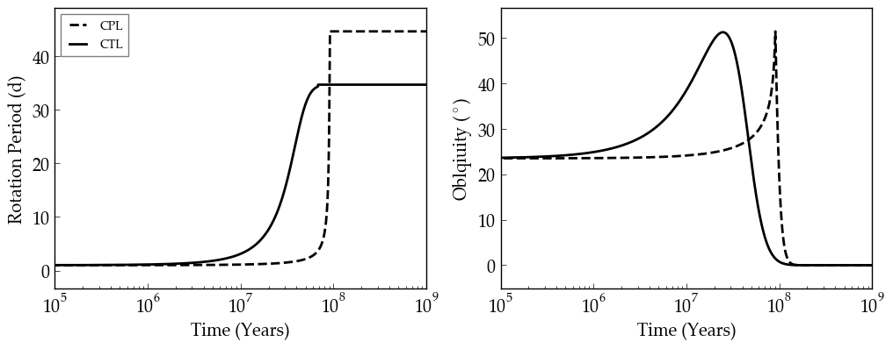

Tidal Locking of the Planet Candidate Gl 581 d
==========

Overview
--------

This example shows tidal locking for the planet candidate Gl 581 d.

===================   ============
**Date**              04/09/2019
**Author**            Rory Barnes
**Modules**           EqTide
**Approx. runtime**   5 seconds each
**Source code**       `GitHub <https://github.com/VirtualPlanetaryLaboratory/vplanet-private/tree/master/examples/IoHeat>`_
===================   ============

Although Gl 581 d is no longer thought to be a planet, this example reproduces
Fig. 6 in Heller et al. (2011) and validates the EqTide module. Results for the
rotational period and obliquity for both the CPL and CTL models are shown.

To run this example
-------------------

.. code-block:: bash

   cd CPL
   vplanet vpl.in

   cd ../CTL
   vplanet vpl.in

   python makeplot.py <pdf | png>

Expected output
---------------

**Left:** Rotational period evolution for the CPL (dashed curve) and CTL (solid curve)
assuming an initial rotation period of 1 day, a tidal Q of 100, and and obliquity
of 23.5 degrees. **Right:** Same, but for obliquity.
