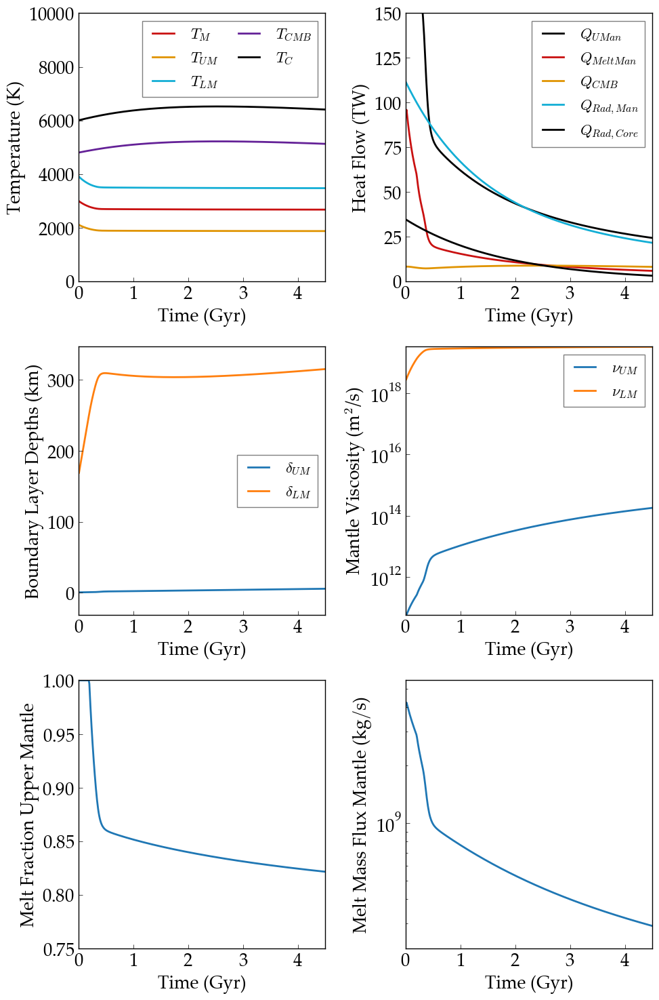
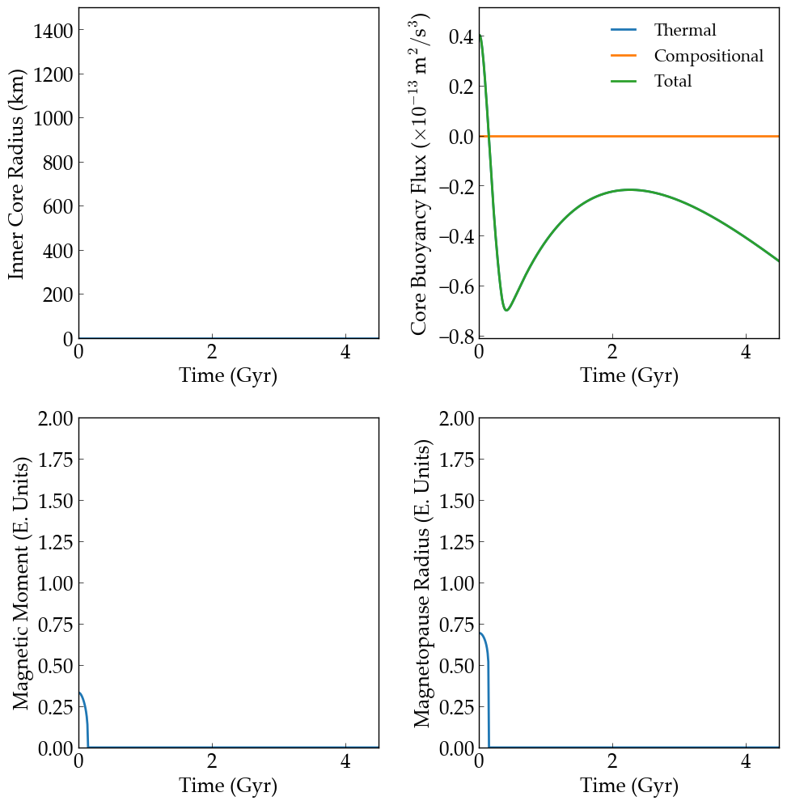

Thermal and Magnetic Evolution of Venus
==========

Overview
--------

Internal evolution of Venus.

===================   ============
**Date**              10/15/18
**Author**            Peter Driscoll
**Modules**           RadHeat ThermInt
**Approx. runtime**   <1 second
===================   ============

This example uses the stagnant lid model of Venus to estimate its thermal and magnetic
evolution. Without much data on its interior, this problem is underconstrained, but
**VPLanet** does reproduce the available observations. These figures reproduce Fig. 6 from Driscoll & Bercovici (`2014 <https://ui.adsabs.harvard.edu/abs/2014PEPI..236...36D/abstract>`_).

To run this example
-------------------

.. code-block:: bash

   vplanet vpl.in
   python makeplot.py <pdf | png>

Expected output
---------------

Analagous to EarthInterior.  Nominal thermal history of the Venus, mantle and core.  Radiogenic
heating is from **RadHeat**. Magnetic moment evolution is estimated from
the core energy balance and inner core growth.
