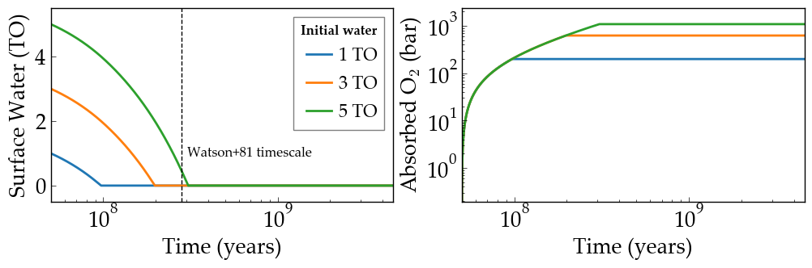
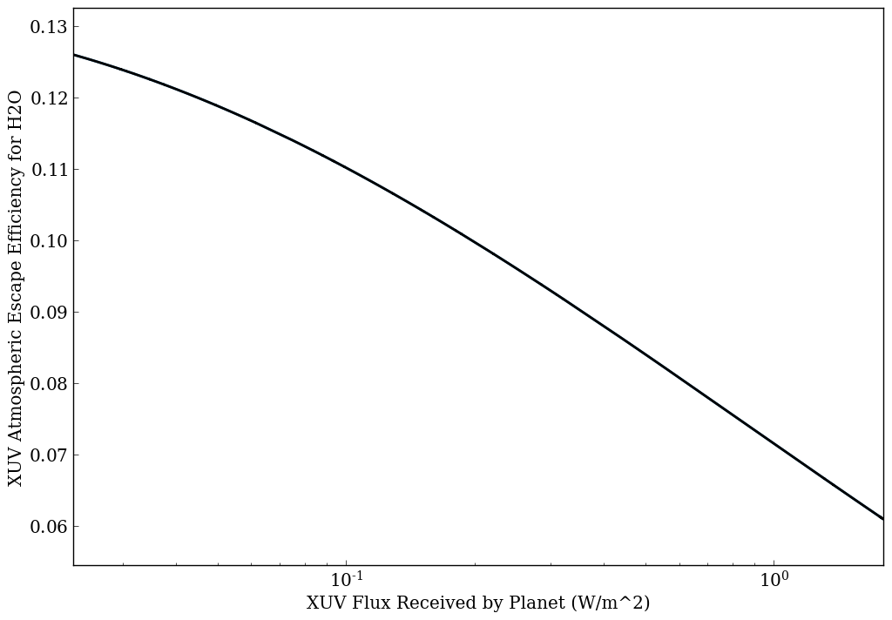

Water Loss on Venus
===========

Overview
--------

Water loss on Venus from thermal escape processes.

===================   ============
**Date**              07/25/18
**Author**            Rodrigo Luger, Rudy Garcia
**Modules**           AtmEsc
                      STELLAR
**Approx. runtime**   49 seconds
===================   ============

The Sun's XUV radiation likely removed water from Venus early in the history of the
Solar System. If Venus was in a runaway greenhouse, then water would be in the
stratosphere where it can be photolyzed and the hydrogen can escape. `Watson et al.
(1981) <https://ui.adsabs.harvard.edu/abs/1981Icar...48..150W/abstract>`_ estimated 280 Myr, but did not account for early activity. Including that effect,
**VPLanet** predicts a desiccation timescale of about 100 Myr.

To run this example
-------------------

.. code-block:: bash

    python makeplot.py <pdf | png>

Expected output
---------------

Evolution of the surface water content (left) and amount of oxygen absorbed
by the surface (right) as a function of time for three different initial
surface water inventories. The vertical dashed line is the `Watson et al.
(1981) <https://ui.adsabs.harvard.edu/abs/1981Icar...48..150W/abstract>`_ timescale for the desiccation of Venus.

The scaling of the atmospheric escape efficiency for H2O as a function of the XUV flux
received by the planet as reported by `Bolmont et al. (2017) <https://ui.adsabs.harvard.edu/abs/2017MNRAS.464.3728B/abstract>`_.
