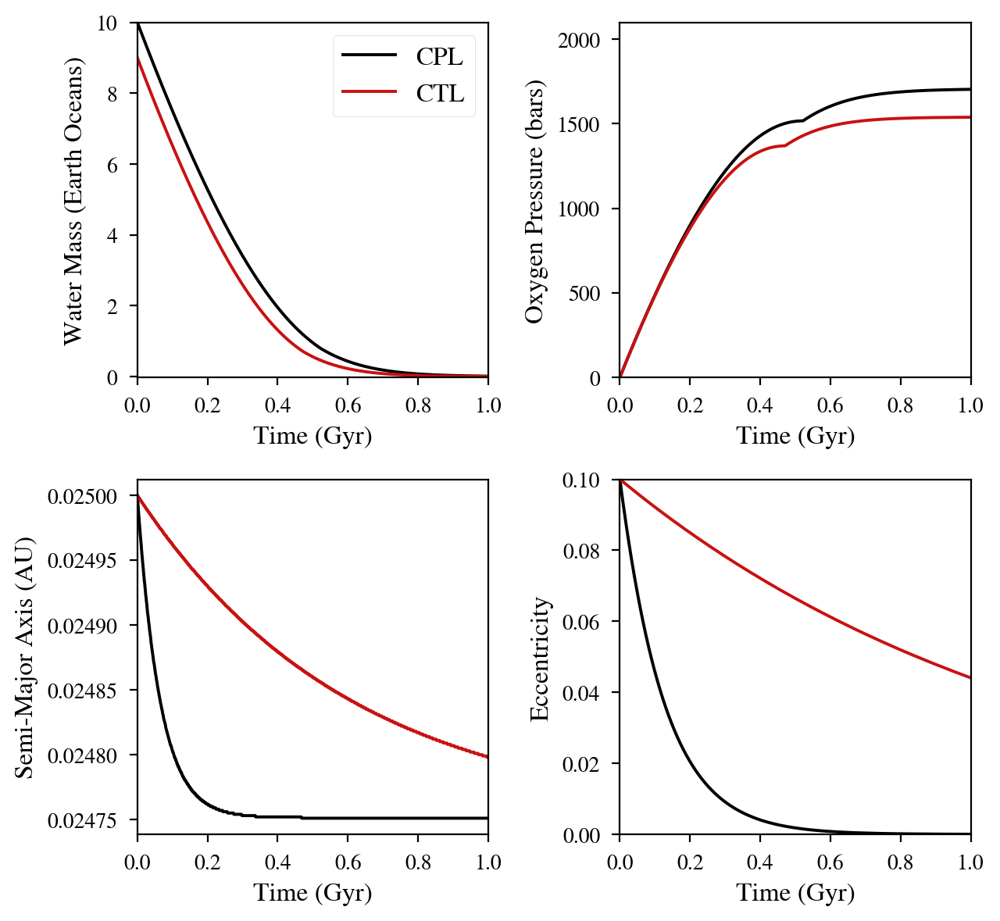

Water Loss on a Tidally Evolving Planet
==============================================

Overview
--------

Many planets on short-period orbits experience tidal effects and atmospheric
escape simultaneously. This example demonstrates this coupling for planets whose
water is being photolytically destroyed

===================   ============
**Date**              02/28/2020
**Author**            Rory Barnes
**Modules**           AtmEsc
                      EqTide
**Approx. runtime**   4 seconds
===================   ============

To run this example
-------------------

.. code-block:: bash

    python makeplot.py <pdf | png>

Expected output
---------------

   Evolution of planets losing water while tidally evolving. The black curves
   assume the CPL model; red the CTL model. In both cases water loss is
   energy-limited and the efficiency follows the results of Bolmont et al.
   (2016). For plotting clarity, the CPL model begins with 10 Earth oceans of
   water and CTL with 9. The .in files for this figure are in the `WaterCPL
   <WaterCPL>`_ and `WaterCTL <WaterCTL>`_ directories.
