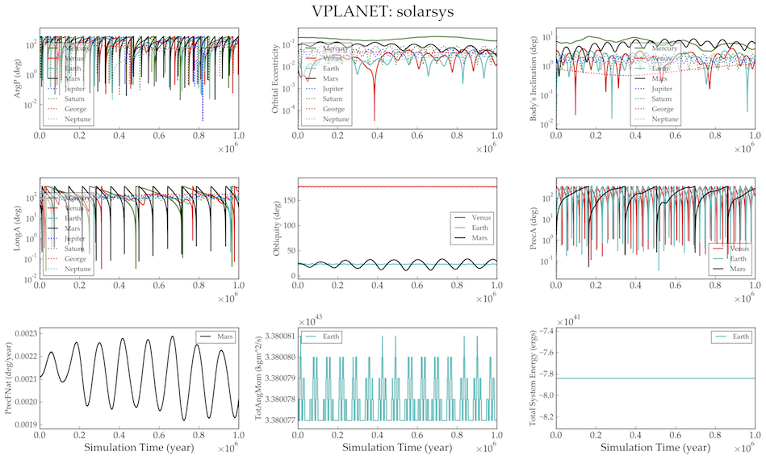

Solar System Dynamics I
=======================

Overview
--------

===================   ============
**Date**              10/01/15
**Author**            Russell Deitrick
**Modules**           `distorb <../src/distorb.html>`_
                      `distrot <../src/distrot.html>`_
**Approx. runtime**   58 seconds
**Source code**       `GitHub <https://github.com/VirtualPlanetaryLaboratory/vplanet-private/tree/master/examples/dist_solsys1>`_
===================   ============

Runs the orbital evolution of the eight planets in the solar system
and the rotational evolution of Venus, Mars, and the moonless Earth.

To run this example
-------------------

.. code-block:: bash

    vplanet vpl.in
    vplot

or

.. code-block:: bash

    python plotsolsys.py

Expected output
---------------

   Evolution of the orbital properties of the eight Solar System planets over a timescale of one
   million years.
   From left to right, top to bottom: evolution of the argument of pericenter, orbital eccentricity,
   orbital inclination, longitude of ascending node, obliquity, precession angle, natural precession
   frequency, total system angular momentum, and total system energy.
