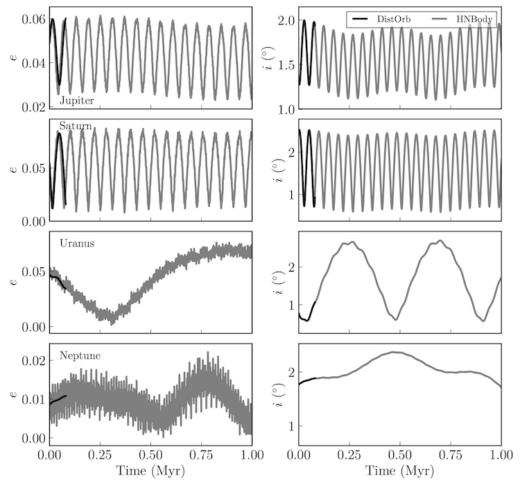
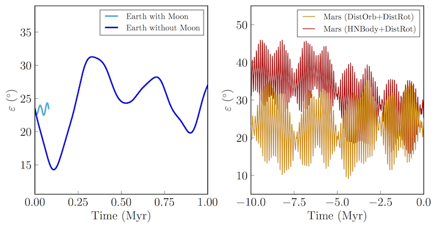

Solar System Dynamics II
========================

Overview
--------

===================   ============
**Date**              07/24/18
**Author**            Russell Deitrick
**Modules**           `distorb <../src/distorb.html>`_
                      `distrot <../src/distrot.html>`_
**Approx. runtime**   | 176 seconds (:code:`vpl.in`)
                      | 159 seconds (:code:`womoon/vpl.in`)
                      | 9 seconds (:code:`marshnb/vpl.in`)
                      | 87 seconds (:code:`marsvpl/vpl.in`)
**Source code**       `GitHub <https://github.com/VirtualPlanetaryLaboratory/vplanet-private/tree/master/examples/dist_solsys2>`_
===================   ============

.. todo:: **@rdetrick** Please add a description to the **dist_solsys2** example.

To run this example
-------------------

.. code-block:: bash

    # Run the main script
    vplanet vpl.in

    # Run the script without the Earth's moon
    cd womoon
    vplanet vpl.in
    cd ..

    # Run the Mars N-Body script
    cd marshnb
    vplanet vpl.in
    cd ..

    # Run the Mars vplanet script
    cd marsvpl
    vplanet vpl.in
    cd ..

    python plotsolsys.py

Expected output
---------------

.. todo:: **@rdetrick** Please add a caption to the figures in the **dist_solsys2** example.

.. figure:: InnerSolOrbs.png
   :width: 600px
   :align: center

