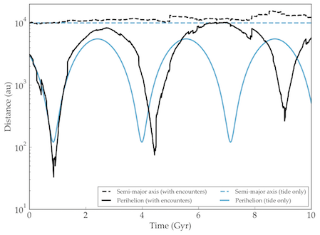

Galactic Habitat
================

Overview
--------

===================   ============
**Date**              07/25/18
**Author**            Russell Deitrick
**Modules**           `galhabit <../src/galhabit.html>`_
**Approx. runtime**   | 183 seconds (:code:`vpl.in`)
                      | 175 seconds (:code:`tides_only/vpl.in`)
**Source code**       `GitHub <https://github.com/VirtualPlanetaryLaboratory/vplanet-private/tree/master/examples/galhabit>`_
===================   ============

.. todo:: **@deitrr**: Description needed for the **galh_test** example.

To run this example
-------------------

.. code-block:: bash

    # Run the main example
    vplanet vpl.in

    # Run the `tides_only` example
    cd tides_only
    vplanet vpl.in
    cd ..

    # Plot the figure
    python plotgalh.py

Expected output
---------------

.. todo:: **@deitrr**: Caption needed for the **galh_test** example figure.

