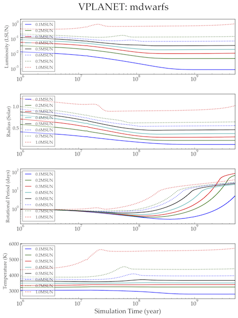

main_seq
========

Overview
--------

===================   ============
**Date**              10/19/15
**Author**            Rory Barnes
**Modules**           `stellar <../src/stellar.html>`_
**Approx. runtime**   24 seconds
**Source code**       `GitHub <https://github.com/VirtualPlanetaryLaboratory/vplanet-private/tree/master/examples/main_seq>`_
===================   ============

A test of the Baraffe evolution models for a range of stellar masses.

To run this example
-------------------

.. code-block:: bash

    vplanet vpl.in
    vplot

Expected output
---------------

   Evolution of the luminosity, radius, period, and temperature of M, K, and G dwarfs as a function of time
   according to the Baraffe et al. (2015) stellar evolution tracks.
