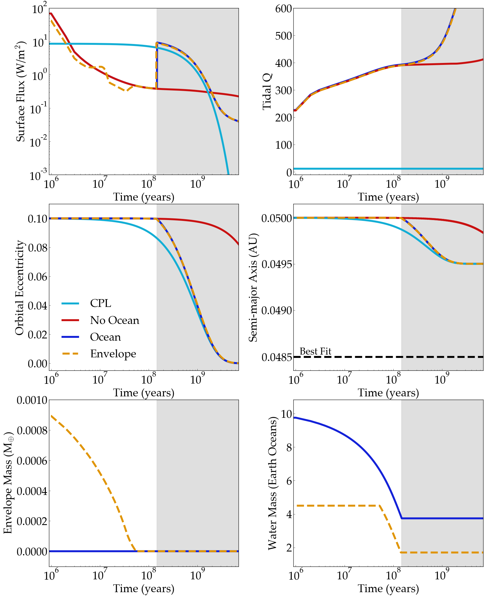

Tidal Evolution of Ocean Planet
===================================

Overview
--------

Each subdirectory contains a simulation of the long-term tidal evolution of Proxima Centauri b.
In cpl, we model tidal evolution with eqtide and the stellar evolution of the host star using stellar.
In no_ocean, we generalize the cpl runs by additionally simulating the planetary thermal interior by including radheat
and thermint.  In ocean, we generalize the ocean case by modeling the tidal impact of liquid surface oceans.
Finally, in env_ocean, we generalize the ocean case by modeling the tidal impact and atmospheric escape on
Proxima Centauri b if it initially formed with an extended hydrogen envelope. These simulations
reproduce Figure 25 from Barnes et al. (2016).

===================   ============
**Date**              8/17/2018
**Author**            David Fleming
**Modules**           `atmesc <../src/atmesc.html>`_
                      `eqtide <../src/eqtide.html>`_
                      `radheat <../src/radheat.html>`_
                      `stellar <../src/stellar.html>`_
                      `thermint <../src/thermint.html>`_
**Approx. runtime**   30s
**Source code**       `GitHub <https://github.com/VirtualPlanetaryLaboratory/vplanet-private/tree/master/examples/tidal_ocean>`_
===================   ============

To run this example
-------------------

.. code-block:: bash
    cd cpl
    vplanet vpl.in
    vplot

Repeat process for each sub-directory: cpl, no_ocean, ocean, env_ocean.

Once the simulations are finished, run

.. code-block:: bash
    python tidal_ocean.py

Expected output
---------------

   Evolution of the orbital, tidal and atmospheric properties of Proxima Centauri b for the “CPL” case in light blue, “No Ocean” case in
   red, “Ocean” case in dark blue, and the “Envelope” case in orange, with the dashed line for clarity. See Barnes et al. (2016), Section 4.6
   for a detailed description of the initial conditions. The grey shaded region indicates when the planet is in the habitable zone.
   Top left: Surface Flux. Top right: Tidal Q. Middle left: Orbital Eccentricity. Middle right: Semi-major Axis.
   Bottom left: Envelope Mass. Bottom right: Surface Water Mass.
