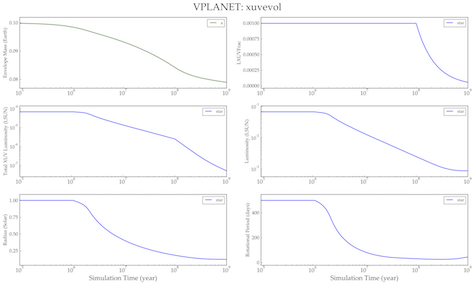

XUV Evolution
=============

Overview
--------

===================   ============
**Date**              10/19/15
**Author**            Rodrigo Luger
**Modules**           `stellar <../src/stellar.html>`_
                      `atmesc <../src/atmesc.html>`_
**Approx. runtime**   6 seconds
**Source code**       `GitHub <https://github.com/VirtualPlanetaryLaboratory/vplanet-private/tree/master/examples/xuv_evol>`_
===================   ============

An example of stellar XUV luminosity evolution.

To run this example
-------------------

.. code-block:: bash

    vplanet vpl.in
    vplot

Expected output
---------------

   Evolution of an evaporating gaseous exoplanet and its star, showing the coupling between
   atmospheric escape and the evolution of the stellar XUV luminosity.
